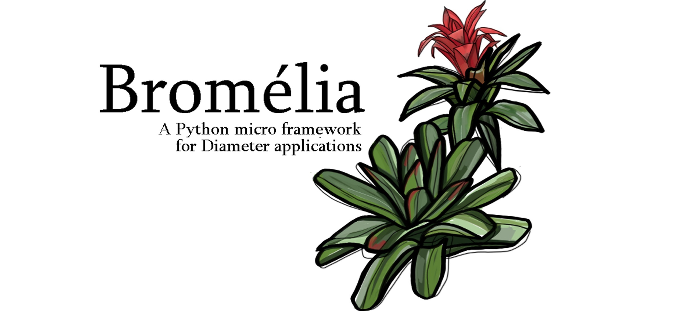

# Bromélia

[](artwork/bromelia.jpg)

A Python micro framework for building Diameter protocol applications.

- [The Reason Behind](#the-reason-behind)
- [Installation](#installation)
- [Simple Diameter class example](#simple-diameter-class-example)
- [Simple Bromelia class example](#simple-bromelia-class-example)
- [License](#license)
- [Documentation](#documentation)
- [Thanks](#thanks)
- [Links](#links)

## The Reason Behind

*bromelia* has breathed for the first time to give a Pythonic way for manipulating Diameter protocol structures. Since there is a bunch of ways to handle the well-known HTTP protocol in an elegant fashion in Python, it lacks the same with Diameter.

It is designed to allow at least (but not limited to) five use cases:

 1. Automate tests on Diameter-based mobile network platforms, such as 4G EPC and IMS networks,
 2. Unlock front-end applications to interact with Diameter-based mobile network applications,
 3. Inspect real Diameter traffic to extract relevant information,
 4. Translate and interwork between Diameter and other telco protocols (2G/3G MAP e 5G HTTP/2 SBI),
 5. Just have some fun.

It makes pretty easy and straightforward to start building the basic Diameter structures such as AVPs and Messages and send them down to/receive from the wire.

*bromelia* is powered with all AVPs and Messages defined in RFC 6733 (and more!).

For debugging and research purpose, it is also possible to create Diameter objects with raw bytes (eg. captured from network interfaces with both tcpdump and tshark tools).

Last but not least, the *bromelia* is extensivily tested using `unittest` and require only one third-party package ([pyyaml](https://github.com/yaml/pyyaml)) which is used for parse the YAML config file in the `Bromelia` class. The test suite are a good source of knownledge and documentation, where you may find examples on how to use each object and functions [here](tests/).

[](https://pypi.org/project/bromelia)

## Installation

Install and update using `pip`:

```bash
python3 -m pip install -U Bromelia
```

Dependencies can be installed using pip:

```bash
python3 -m pip install -r requirements.txt
```

Run unittests:

```bash
python3 -m unittest tests/*.py
python3 -m unittest tests/avps/etsi_3gpp*/*.py
python3 -m unittest tests/avps/ietf*/*.py
python3 -m unittest tests/lib/etsi_3gpp*/*.py
```

Then after setting up the config file as per explained in the [Tutorials](#tutorials) section, you can run the Diameter application by issuing the Python interpreter. Keep in mind there are two ways to spin up a Diameter application: either with Diameter class or Bromelia class.

## Simple Diameter class example

Find more information on how to run a simple Diameter class example in [examples/diameter-app1/README.md](examples/diameter-app1/README.md).

```python
#: Script found in examples/diameter-app1/diameter_mme.py
from bromelia import Diameter
from bromelia import DiameterRequest
from bromelia.avps import *
from bromelia.lib.etsi_3gpp_s6a import *
from bromelia.lib.etsi_3gpp_swm import *

LOCAL_HOSTNAME = "mme.epc.mynetwork.com"
LOCAL_REALM = "epc.mynetwork.com"
REMOTE_HOSTNAME = "hss.epc.mynetwork.com"
REMOTE_REALM = "epc.mynetwork.com"

#: Basic Diameter object config
config = {
            "MODE": "CLIENT",
            "APPLICATIONS": [{
                                "vendor_id": VENDOR_ID_3GPP, 
                                "app_id": DIAMETER_APPLICATION_S6a_S6d
            }],
            "LOCAL_NODE_HOSTNAME": LOCAL_HOSTNAME,
            "LOCAL_NODE_REALM": LOCAL_REALM,
            "LOCAL_NODE_IP_ADDRESS": "127.0.0.1",
            "LOCAL_NODE_PORT": 3868,
            "PEER_NODE_HOSTNAME": REMOTE_HOSTNAME,
            "PEER_NODE_REALM": REMOTE_REALM,
            "PEER_NODE_IP_ADDRESS": "127.0.0.1",
            "PEER_NODE_PORT": 3870,
            "WATCHDOG_TIMEOUT": 30
}

app = Diameter(config=config)

#: Basic DiameterAVPs for ULR message
avps = [
            SessionIdAVP(LOCAL_HOSTNAME),
            AuthSessionStateAVP(NO_STATE_MAINTAINED),
            OriginHostAVP(LOCAL_HOSTNAME),
            OriginRealmAVP(LOCAL_REALM),
            DestinationRealmAVP(REMOTE_REALM),
            UserNameAVP("123456789123456"),
            RatTypeAVP(RAT_TYPE_EUTRAN),
            UlrFlagsAVP(3)
]

#: Create ULR message
ulr = DiameterRequest(command_code=316, application_id=16777251)
ulr.extend(avps)

#: Setup Diameter connection, send ULR & receive ULA
with app.context():
    while app.is_open():
        ula = app.send_message(ulr)
        break
```

```bash
$ python3 examples/diameter-app1/diameter_mme.py
  * Running Diameter app (3GPP S6a) on 127.0.0.1:3868 as CLIENT mode (CEX)
```

For more information, see [How to build your Diameter application: The 1st way (Not that good)](docs/diameter-app1.md) in [Documentation](#documentation) section.

## Simple Bromelia class example

Find more information on how to run a simple Bromelia class example in [examples/diameter-app2/README.md](examples/diameter-app2/README.md).

```python
#: Script found in examples/diameter-app2/bromelia_mme.py
from bromelia import Bromelia
from bromelia.constants import *
from bromelia.lib.etsi_3gpp_s6a import *
from bromelia.lib.etsi_3gpp_s6a import CLA # CancelLocationAnswer
from bromelia.lib.etsi_3gpp_s6a import CLR # CancelLocationRequest

#: Application initialization 
config_file = os.path.join(basedir, "bromelia_mme_config.yaml")

app = Bromelia(config_file=config_file)
app.load_messages_into_application_id([CLA, CLR], DIAMETER_APPLICATION_S6a_S6d)

CLA = app.s6a_s6d.CLA   #: Creating CLA alias

@app.route(application_id=DIAMETER_APPLICATION_S6a_S6d, command_code=CANCEL_LOCATION_MESSAGE)
def clr(request):
    return CLA(result_code=DIAMETER_SUCCESS)

if __name__ == "__main__":
    app.run()   #: It will be blocked until connection has been established
```

```bash
$ python3 examples/diameter-app2/bromelia_mme.py
  * Running Diameter app (3GPP S6a) on 127.0.0.1:3868 as CLIENT mode (CEX)
```

For more information, see [How to build your Diameter application: The 2nd way (The Best ever!)](docs/diameter-app2.md) in [Documentation](#documentation) section.

## License

*bromelia* is licensed under the terms of the MIT License. See the LICENSE file for the exact license text.

## Documentation

The documentation for *bromelia* is composed of tutorials on basic usage and links to the source for various predefined type classes.

### Tutorials

- [Building Blocks Part 1: Data Types](docs/data-types.md)
- [Building Blocks Part 2: Diameter AVPs](docs/avps.md)
- [Building Blocks Part 3: Diameter Messages](docs/messages.md)
- [How to build your Diameter application: The 1st way (Not that good)](docs/diameter-app1.md)
- [How to build your Diameter application: The 2nd way (The Best ever!)](docs/diameter-app2.md)

### Reference

- [Base Structures](bromelia/base.py), `bromelia.base`
- [Bromelia](bromelia/bromelia.py), `bromelia.bromelia`
- [Constants](bromelia/constants), `bromelia.constants`
- [Data Types](bromelia/types.py), `bromelia.types`
- [Diameter AVPs](bromelia/avps), `bromelia.avps`
- [Diameter Messages](bromelia/messages.py), `bromelia.messages`
- [Peer State Machine](bromelia/statemachine.py), `bromelia.statemachine`

## Thanks

Big thanks to my family and friends who have inspired me and supported this project.

## Links

The *bromelia* library implements several pieces of different IETF RFC and 3GPP technical specs. If you want to look at a specific documentation after noticing it on the code comments (such as Diameter AVPs and Diameter Messages), follow the instructions below.

### IETF spec

Use the pattern.

`https://tools.ietf.org/html/rfc<NUMBER>`

For instance, the RFC 6733 may be found as per link below.

[https://tools.ietf.org/html/rfc6733](https://tools.ietf.org/html/rfc6733)

### 3GPP spec

Use the link below to find a specific 3GPP TR/TS and its version. Fulfil the form and click on `search`.

[https://webapp.etsi.org/key/queryform.asp](https://webapp.etsi.org/key/queryform.asp)
