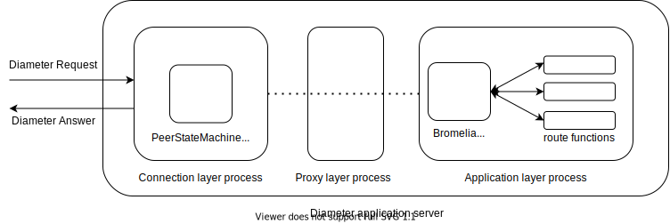
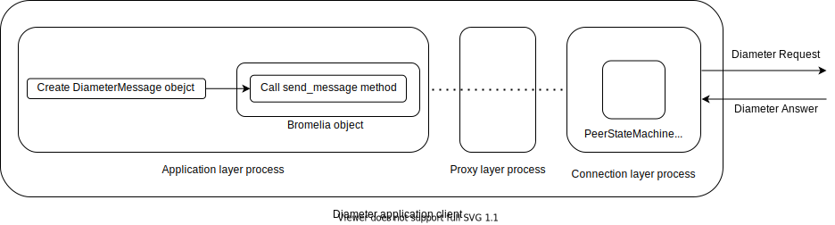

# How to build your Diameter application: The 2nd way (The Best ever!)

This document covers how to build your Diameter application from the ground up by using the Bromelia class.

This page contains the following sections:

- [Bromelia has grown stronger](#bromelia-has-grown-stronger)
- [The Ultimate Bromelia class](#the-ultimate-bromelia-class)
- [Starting the project](#starting-the-project)
- [Next steps](#next-steps)

## Bromelia has grown stronger

We already know how to [setup both Diameter application client and server](docs/diameter-app1.md) with *bromelia* library. That's a good way to use the library to connect to backend servers or even being a backend server in order to reply Diameter requests. However it is not that good at all. Actually, this was the first main *bromelia* functionality. Since the first breath, *bromelia* has grown stronger and learnt how to scale and being more friendly to developers who want to get its hands a bit dirty with the telecom world.

I've been thinking that should have a better way to setup not only one Diameter connection, but two, three or even more. It should have a better way to handle different Diameter Requests in a Diameter application server. It should have a better way to bundle Diameter messages (both Requests and Answers) for a given Diameter application and have it easily to be used along the code. A better way in which there is no need to create a context manager to setup a Diameter connection. There were so many things that was popping up into my mind while I was trying to create a real Diameter application with *bromelia* library, that I decided to give a more Pythonic way to handle the Diameter protocol.

## The Ultimate Bromelia class

That's why `bromelia.py` module comes into place with the ultimate `Bromelia` class which intents to address all my Diameter design concerns and desires.

By importing the `Bromelia` class and instantiating a `Bromelia` object, the Python interpreter will be forked (or forked-like in Windows machines) into 3 Python interpreters. The first one (application layer) holds the main script where `Bromelia` object was defined. That is the place where you should implement the logic of your Diameter application. Here you will find the concept of `route` functions to easily create Diameter applications. The second one (connection layer) holds the Diameter connection itself. In other means, its role is to setup, maintain and release a Diameter connection by using the Diameter base protocol messages such as CER/CEA, DWR/DWA and DPR/DPA respectively. Here the `Diameter` class is wrapped to get this role done. There is no need to interact with this layer, which should be transparent to the application layer. Finally, the third one (proxy layer) acts as a proxy process to allow interchanging Diameter messages between application and connection layer. There is no need to interact with it as well.

In short: all you have to do is instantiating a `Bromelia` object and starting to create `route` functions for each Diameter application message.

Under the hood, this is what happens: an incoming byte stream from network will be captured by connection layer process. If indeed it is a Diameter byte stream, either a `DiameterRequest` object or `DiameterAnswer` object will be created - or even another subclass object. For instance, in case an expected Diameter message is received, another object may be created, such as `CapabilityExchangeRequest` object. Those objects are passed from connection layer process to application layer process through the proxy layer process. There are six objects that will never be passed to application layer, because are objects related to connection layer process only - that is, `CapabilityExchangeRequest`, `CapabilityExchangeAnswer`, `DeviceWatchdogRequest`, `DeviceWatchdogAnswer`, `DisconnectPeerRequest` and `DisconnectPeerAnswer`. Any Diameter message object different from those ones, should be proxied.

Once in application layer process, the `Bromelia` object is responsible to send this Diameter message object to its `route` function. It depends on the Application Id and Command Code of the Diameter message. A match of those header attributes with a `route` function will trigger a series of steps that should be implemented by the developer. All `route` functions shall return a `DiameterAnswer` object or a subclass object in other to send a response to peer node. This Diameter answer will be formatted automatically with the Session-Id AVP and both Hop-By-Hop and End-To-End header attributes of the Diameter Request. In case an exception has been raised in the `route` function, `Bromelia` object will format a `DiameterAnswer` object with Result-Code AVP set to `UNABLE_TO_COMPLY`. Whatever is the content of the Diameter Answer, this object will be proxied from application layer process to connection layer process through the proxy layer process and replied to peer node over the network.

[](assets/diameter_application_server.svg)

Surely all we have just described are pretty much glued with the Diameter application server concept. However the design of three processes components will still take place when using `Bromelia` class to create Diameter application clients. Here the Diameter application client will instantiate the `Bromelia` object and the three processes will start running. By using its `.send_message()` method, the reverse work will be performed. The Diameter message object passed to `.send_message()` method in the application layer process will be proxied to connection layer process through the proxied layer process and finally the Diameter message will be serialized to the wire.

[](assets/diameter_application_client.svg)

There is a reason why (at least) three processes are created by using the `Bromelia` object. The infamous [Python GIL](https://wiki.python.org/moin/GlobalInterpreterLock) allows only one thread to hold the control of the Python interpreter. As a consequence, CPU-bound and multi-threaded Python applications will have its performance bottlenecked. To implement a Diameter application in any programming language, several functions should be running simultaneously, such as listening or sending streams of data over a socket, parsing and formatting the data stream, sending Device-Watchdog-Request messages from time to time, tracking the state machine of a given Diameter connection, waiting for answers, processing requests, creating answer, and so on. Creating a Diameter application server multithreaded over GIL would be dead end and would be a tough work increasing performance. That's the reason why this design has been considered. We may hold a few of this functions in separated processes which will be properly schedule by the OS. Surely a proxy layer process introduces an undesired overhead, however this is better than be locked by the GIL.

Finally, it is worth saying that at least three processes are created because it will depend on how many Diameter interfaces a given Diameter application server need. For instance, in an [EPC network](https://www.etsi.org/deliver/etsi_ts/123400_123499/123401/15.04.00_60/ts_123401v150400p.pdf), a HSS will use only one Diameter interface ([S6a/S6d](https://www.etsi.org/deliver/etsi_ts/129200_129299/129272/15.04.00_60/ts_129272v150400p.pdf)) to communicate with an MME or SGSN. However, a [AAA](https://www.etsi.org/deliver/etsi_ts/129200_129299/129273/14.03.00_60/ts_129273v140300p.pdf) will have three Diameter interfaces to allow subscribers to get authenticated and authorized in the EPC network when coming from a Non-3GPP Access, such as Wi-Fi.

In the first example above, three processes will be created (1 connection layer process + 1 proxy layer process + 1 application layer process). In the second example, seven processes will be created (1 connection layer process + 3 proxy layer processes + 3 proxy layer processes).

## Starting the project

From here on will be going to reimplement the exact same MME and HSS functions that we did in the [last article](docs/diameter-app1.md). The difference is that instead of using the `Diameter` class to spin up a Diameter connection, we'll use the `Bromelia` class. For a better understanding, you may take a look at last article side-by-side with this one.

Without further ado, let's move on.

### Connection Layer (Config file)

`Bromelia` objects rely on config file. By default, when instantiating a `Bromelia` object, it will look up for a `config.yaml` in the current working directory. It is also possible to provide a custom path to a config file. As you may have noticed, the config file follows the YAML structured data format to data serialization. It is used to create the connection layer process. In other words, fulfilling the values for each key should be enough to setup a Diameter connection with a peer node, usually a [DRA](https://www.etsi.org/deliver/etsi_ts/129200_129299/129213/12.07.00_60/ts_129213v120700p.pdf). You can do that even if your application layer is not already done. Of course, an incoming Diameter Request will be proxied from connection layer process to application layer process through the proxy process as expected, but once there is no `route` function to handle it, the Diameter Request will not be processed and the peer node won't receive any Diameter Answer.

First things first. Let's create a custom config file for MME and walk through.

#### [examples/diameter-app2/bromelia_mme_config.yaml](../examples/diameter-app2/bromelia_mme_config.yaml)

```yaml
api_version: v1
name: MME
spec:
  - applications:
      - vendor_id: VENDOR_ID_3GPP
        app_id: DIAMETER_APPLICATION_S6a_S6d
    mode: Client
    watchdog_timeout: 30
    local:
      ip_address: 127.0.0.1
      hostname: my-mme.epc.mynetwork.com
      realm: epc.mynetwork.com
      port: 3868
    peer:
      ip_address: 127.0.0.1
      hostname: my-hss.epc.mynetwork.com
      realm: epc.mynetwork.com
      port: 3870
```

The `api_version` key specifies the version of the config file. The `name` key specifies the Diameter application name. It won't be exchanged with the peer node. It should be used only for an organization matter. The `spec` key denotes a list of applications. Each application (list member) may have one or more Diameter Application associated. That's the reason why `vendor_id` and `app_id` keys appear as another list structure. In general, we strong encourage to use only one Diameter Application per application list member. Keep in mind both `vendor_id` and `app_id` keys must follow the constant names defined in `bromelia/constants.py` module. So if you want to go with the Diameter Application SWm, you should include the `DIAMETER_APPLICATION_SWm` value.

The `mode` key defines whether your connection layer process will work as `Client` or `Server` from the connection point of view. In other words, if set as `Client` as soon as the `.run()` method is called in application layer process, it will notify the connection layer process to start the Diameter connection procedure by sending CER message to the peer node. If set as `Server` as soon as the `.run()` method is called in application layer process, it will notify the connection layer process to listen to Diameter CER message from a given peer node and send CEA under reception of a CER message.

The `watchdog_timeout` key specifies how long the connection layer process should wait to probe the connection status by sending a DWR message. In the example, a DWR will be sent every 30 seconds to the peer node.

The `local` key specifies an object with four attributes which define the local node - that is, your Diameter application. The `peer`key specifies an object with four attributes as well which define the peer node - that is, the Diameter application end which your Diameter application will communicate with. Both have the same `ip_address`, `hostname`, `realm` and `port` keys. The first three are self explanatory, but the fourth one - `port` - worth a note. The `port` key is used if the `mode` key is set as `Server` only. It `mode` is set as `Client`, the value set in `port` key won't be used at all.

Now that we already know how to build a config file, let's do the same for HSS.

#### [examples/diameter-app2/bromelia_hss_config.yaml](../examples/diameter-app2/bromelia_hss_config.yaml)

```yaml
api_version: v1
name: HSS
spec:
  - applications:
      - vendor_id: VENDOR_ID_3GPP
        app_id: DIAMETER_APPLICATION_S6a_S6d
    mode: Server
    watchdog_timeout: 30
    local:
      ip_address: 127.0.0.1
      hostname: my-hss.epc.mynetwork.com
      realm: epc.mynetwork.com
      port: 3870
    peer:
      ip_address: 127.0.0.1
      hostname: my-mme.epc.mynetwork.com
      realm: epc.mynetwork.com
      port: 3868
```

Nothing really different here. Notice that we changed the `mode` key from `Client` to `Server` and changed the four attributes keys between `local` and `peer` key objects.

### Application Layer (Python code)

As we have discussed earlier, `Bromelia` class may be used for both Diameter application client or server.

Below you may find two Python modules: [examples/bromelia_mme.py](../examples/diameter-app2/bromelia_mme.py) and [examples/bromelia_hss.py](../examples/diameter-app2/bromelia_hss.py). These modules emulate one specific function for MME and HSS, respectivately, whic is the Cancel Location procedure. Take a look in both modules below and you will find in the sequence a few comments about what is going on.

#### examples/bromelia_mme.py

```python
from bromelia import Bromelia
from bromelia.avps import *
from bromelia.constants import *
from bromelia.etsi_3gpp_s6a_s6d.avps import *
from bromelia.etsi_3gpp_s6a_s6d.messages import CancelLocationAnswer as CLA
from bromelia.etsi_3gpp_s6a_s6d.messages import CancelLocationRequest as CLR

#: Application initialization 
config_file = os.path.join(basedir, "bromelia_mme_config.yaml")

app = Bromelia(config_file=config_file)
app.load_messages_into_application_id([CLA, CLR], DIAMETER_APPLICATION_S6a_S6d)

#: Creating CLA alias
CLA = app.s6a_s6d.CLA

@app.route(application_id=DIAMETER_APPLICATION_S6a_S6d, command_code=CANCEL_LOCATION_MESSAGE)
def clr(request):
    return CLA(result_code=DIAMETER_SUCCESS)

if __name__ == "__main__":
    app.run()
```

#### examples/bromelia_hss.py

```python
from bromelia import Bromelia
from bromelia.avps import *
from bromelia.constants import *
from bromelia.etsi_3gpp_s6a_s6d.avps import *
from bromelia.etsi_3gpp_s6a_s6d.messages import CancelLocationAnswer as CLA
from bromelia.etsi_3gpp_s6a_s6d.messages import CancelLocationRequest as CLR

#: Application initialization 
config_file = os.path.join(basedir, "bromelia_hss_config.yaml")

app = Bromelia(config_file=config_file)
app.load_messages_into_application_id([CLA, CLR], DIAMETER_APPLICATION_S6a_S6d)

#: Creating CLR alias
CLR = app.s6a_s6d.CLR

if __name__ == "__main__":
    app.run()

    clr = CLR(user_name="123456789012345",
              clr_flags=2,
              destination_host=app.configs[0]["PEER_NODE_HOSTNAME"],
              supported_features=[
                                    VendorIdAVP(VENDOR_ID_3GPP),
                                    FeatureListIdAVP(1),
                                    FeatureListAVP(134217728)])

    cla = app.send_message(clr)
```

Try to setup a network dump on your network device (localhost). If you run the `examples/bromelia_hss.py` module first and then run the `examples/bromelia_mme.py` module, you will notice 6 processes will be created: 3 processes to HSS and another 3 processes to MME. Each network element will have 1 application layer process, 1 proxy layer process and 1 connection layer process. Remeber that?

Both connection layer processes will take place and exchange the capabilities through the Capabilities Exchange (CEX) procedure to bringup the Diameter connection. Once both network elements have established the Diameter connection, the HSS will send a Cancel-Location-Request message towards to MME in order to cancel the registration of a given subscriber. Of course, there is no such registration on MME, but let's suppose this is true. By receiving this CLR message, MME simply reply with a successful CLA message to HSS.

To crystallize the understanding: after the CEX procedure, the HSS application layer process create a CLR message then calls the `.send_message()` method passing the `CancelLocationRequest` object. This object is proxied to the HSS connection layer process through the HSS proxy layer process and then sent down to the wire. Actually, this is not true, because we are using the localhost. So the byte stream representing a CLR goes to the kernel (instead to a remote host) and come back to the OS application level to be delivered to the MME connection layer process. Once this is a message of an expected Diameter application (S6a/S6d), a `CancelLocationRequest` object is created and then proxied from the MME connection layer process to the MME application layer process through the MME proxy layer process. The `Bromelia` object in MME side will forward this object to the correct `route` function - that is, the function which will handle CLR messages. All `route` function shall be created decorated with the Bromelia's `.route()` method. The reason behind is that Bromelia's `.route()` method assigns `route` functions to its respective types of Diameter Requests to be processed. Its parameters shall be configured when decorating the `route` function so `Bromelia` object internally can figure it out. All `route` function has `request` input parameter, which points to the Diameter Request message object received by the application layer process - that is, the `CancelLocationRequest` object.

The `route` function called by `clr` simply returns a `CancelLocationAnswer` object setting the `result_code` input parameter as `DIAMETER_SUCCESS`. Then a Cancel-Location-Answer message is created and sent all way back to the HSS application layer process.

Finally, this `CancelLocationAnswer` object generated on the MME application layer process is made available on the HSS application layer process side through the `cla` variable.

## Next steps

We have covered a lot *bromelia* library's functionalities until up now. If you have followed along with me over the articles, surely already discovery how easy is to build Diameter applications. You may know there are tons of Diameter applications, specially from 3GPP specs to Cellular networks. Well, the sky's the limit. Give it a try and implement a Diameter-based network element or at least part of. You could go with HSS (EPC & IMS), PCRF, OCS, AAA and much more. Maybe implementing an IWF between Diameter and 5GC's SBI.

Hope you all have enjoyed understanding the internals of *bromelia* library and may find really interesting and useful things to implement with.

Lastly, remember: always go the [tests](../tests) folder if you are trying to figure out how something should work or be used. Almost all funcionalities have been tested. Those `unittests` scripts are really helpful while using the *bromelia* library to build your application. In case you did not find specific unittest, just starting to import and to explore the features by yourself.
