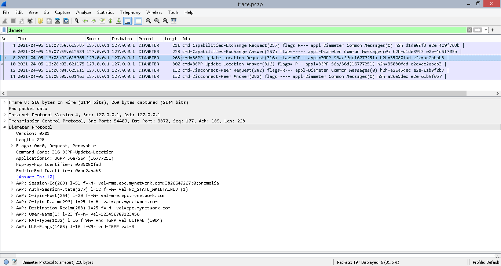

# How to run a simple Diameter class example

[](trace.jpeg)

This folder has two Python modules. The [first one](diameter_hss.py) implements a HSS with the `Diameter` class and the [second one](diameter_mme.py) implements a MME with the `Diameter` class as well.

As you may see, the MME module has been implemented as Client whereas HSS module has been implemented as Server. That's true for the CEX procedure point of view.

That means HSS module must be ran first in order to listen to connections on 3870.

```bash
$ python3 examples/diameter-app1/diameter_hss.py
  * Running Diameter app (3GPP S6a) on 127.0.0.1:3870 as SERVER mode (CEX)
```

Then MME module may be ran to start the CEX procedure and exchange capabilities.

```bash
$ python3 examples/diameter-app1/diameter_mme.py
  * Running Diameter app (3GPP S6a) on 127.0.0.1:3868 as CLIENT mode (CEX)
```

You will notice the CLI will print a new output informing both network elements have been connected to each other. Few seconds later a new output informing both network elements have finally disconnected then - that is, a Disconnecting Peer Connection procedure has been issued by the MME.

## HSS module output

```bash
$ python3 examples/diameter-app1/diameter_hss.py
  * Running Diameter app (3GPP S6a) on 127.0.0.1:3870 as SERVER mode (CEX)
  * Diameter connection on 127.0.0.1:3870 is now up
  * Diameter connection on 127.0.0.1:3870 is now down
```

## MME module output

```bash
$ python3 examples/diameter-app1/diameter_mme.py
  * Running Diameter app (3GPP S6a) on 127.0.0.1:3868 as CLIENT mode (CEX)
  * Diameter connection on 127.0.0.1:3868 is now up
  * Diameter connection on 127.0.0.1:3868 is now down
```

Between the two last outputs in both CLI, a Update-Location-Request message has been sent from MME to HSS, which in turns replied with a successful Update-Location-Answer.

Try to capture your localhost network interface or open up the [trace.pcap](trace.pcap) file. Take a look at both [diameter_hss.py](diameter_hss.py) and [diameter_mme](diameter_mme.py) files to understand the `bromelia` dynamics and figure out how to use it for your own project.

By the way, the [How to build your Diameter application: The 1st way (Not that good)](../../docs/diameter-app1.md) is also a good source of knowledge.
