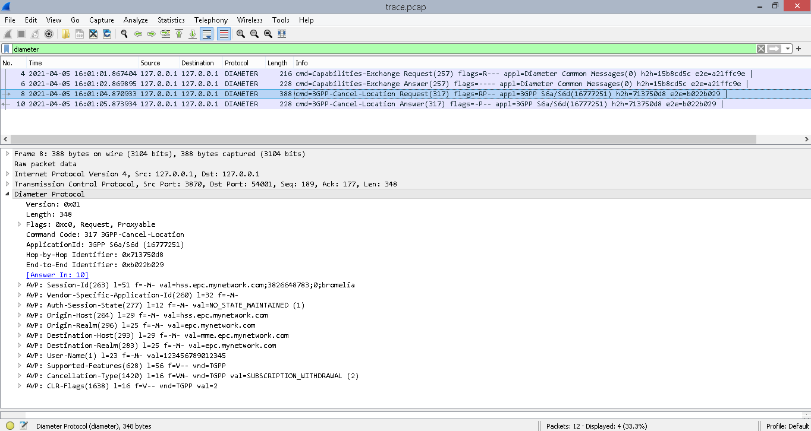

# How to run a simple Bromelia class example

[](trace.jpeg)

This folder has two Python modules. The [first one](bromelia_hss.py) implements a HSS with the `Bromelia` class and the [second one](bromelia_mme.py) implements a MME with the `Bromelia` class as well.

As the same way in the last example, the MME module has been implemented as Client whereas HSS module has been implemented as Server. That's true for the CEX procedure point of view. You may see such information in both `config.yaml` files.

That means HSS module must be ran first in order to listen to connections on 3870.

```bash
$ python3 examples/diameter-app2/bromelia_hss.py
  * Running Diameter app (3GPP S6a) on 127.0.0.1:3870 as SERVER mode (CEX)
```

Then MME module may be ran to start the CEX procedure and exchange capabilities.

```bash
$ python3 examples/diameter-app2/bromelia_mme.py
  * Running Diameter app (3GPP S6a) on 127.0.0.1:3868 as CLIENT mode (CEX)
```

You will notice the CLI will print a new output informing both network elements have been connected to each other. Differently from the last example with Diameter class, it will not have a third output in the CLI. If you want to tear down the application, go ahead and kill the process. The `Bromelia` class has been created in a such way to run indefinetely, once it spins three processes total. You may see there is no Disconnecting Peer Connection procedure issued by any network elements.

## HSS module output

```bash
$ python3 examples/diameter-app2/bromelia_hss.py
  * Running Diameter app (3GPP S6a) on 127.0.0.1:3870 as SERVER mode (CEX)
  * Diameter connection on 127.0.0.1:3870 is now up
```

## MME module output

```bash
$ python3 examples/diameter-app2/bromelia_mme.py
  * Running Diameter app (3GPP S6a) on 127.0.0.1:3868 as CLIENT mode (CEX)
  * Diameter connection on 127.0.0.1:3868 is now up
```

Between the two last outputs in both CLI, a Cancel-Location-Request message has been sent from HSS to MME, which in turns replied with a successful Cancel-Location-Answer.

Try to capture your localhost network interface or open up the [trace.pcap](trace.pcap) file. Take a look at both [bromelia_hss.py](bromelia_hss.py) and [bromelia_mme](bromelia_mme.py) files to understand the `bromelia` dynamics and figure out how to use it for your own project.

By the way, the [How to build your Diameter application: The 2nd way (The Best ever!)](../../docs/diameter-app2.md) is also a good source of knowledge.
